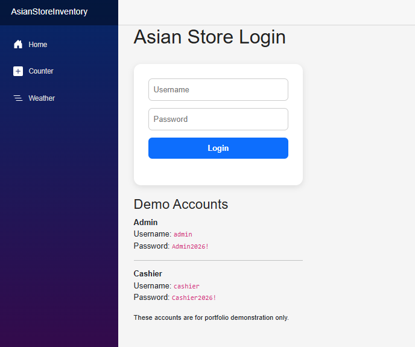
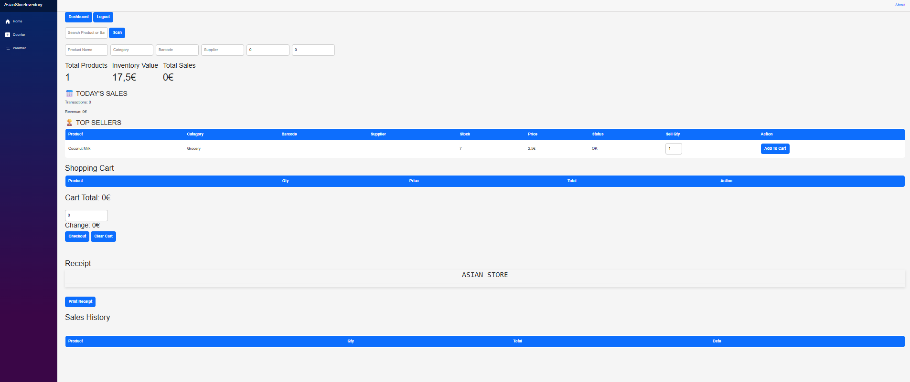
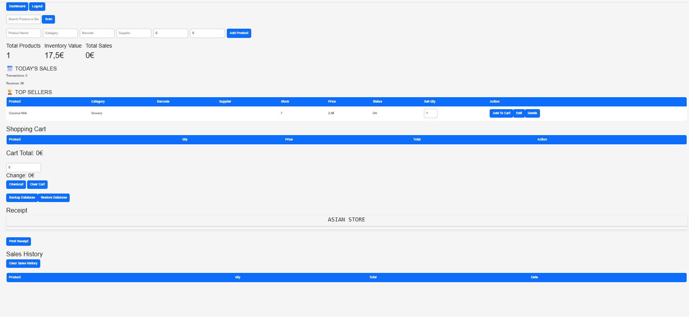
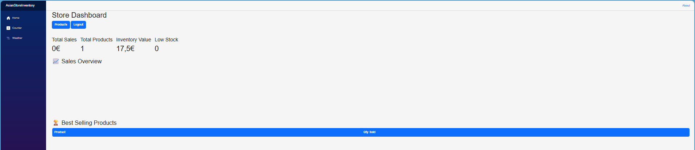

# Asian Store Inventory & POS System

A web-based inventory and point-of-sale (POS) system built with **C#**, **.NET**, **Blazor**, and **SQLite**.

## Features

- Role-based Admin and Cashier login
- Product and inventory management
- Shopping cart and checkout
- Cash payment and change calculation
- Receipt generation and printing
- Sales history and sales totals
- Top sellers
- Low-stock and out-of-stock alerts
- Database backup and restore
- Product search and barcode support
- Admin/Cashier permissions

## User Roles

### Admin

Administrators can:

- Add products
- Edit products
- Delete products
- View sales information
- Backup the database
- Restore the database
- Clear sales history

### Cashier

Cashiers can:

- View products
- Add products to the cart
- Remove items from the cart
- Process sales
- Calculate change
- Generate receipts

Administrative functions are restricted from Cashier users.

## Technologies

- C#
- .NET
- Blazor
- Entity Framework Core
- SQLite
- HTML
- CSS
- Bootstrap
- Git / GitHub

## Demo Accounts

These accounts are for portfolio demonstration only.

**Admin**
- Username: admin
- Password: Admin2026!

**Cashier**
- Username: cashier
- Password: Cashier2026!

## Project Purpose

This project was developed as a practical inventory and POS application demonstrating software development, database management, authentication, role-based access control, CRUD operations, sales processing, and database backup/restore functionality.

## Author

**Jefrey Cervera**

GitHub: https://github.com/jepox27

## Screenshots

### Login

### Store Dashboard

### Admin Inventory & POS

### Cashier POS
